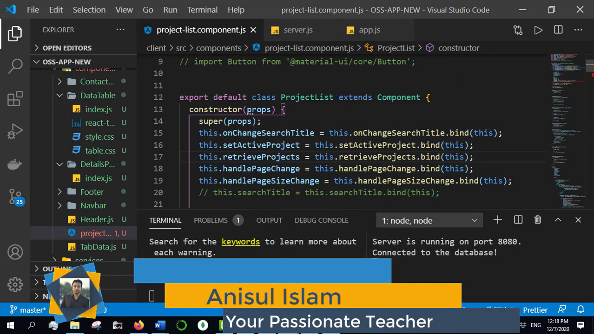

<!-- markdown tutorial -->

abdullah  

this is second line<br>

<br/>

### Horizontal Line

this is third line <hr>

this is another line

---

<br/>

# this is heading 1
## this is heading 2
### this is heading 3
#### this is heading 4
##### this is heading 5
###### this is heading 6

<br/>

<p>this is paragraph</p>

<br/>

<i>this is italic text </i>

_this is italic text_

<br/>

__this is bold text__

<br/>

<del>this is strikethrough</del>

~~this is strikethrough~~

<br/>

`single line comment`

<br/>

### multi line comment
```
    this is muli line comment
```

<br/>

### multi line comment with format
```html
<html>
<head>
    <title>multi line comment</title>
<body>
    <div>this is a html multi line code</div>
</body>
</head>
</html>
```

```javascript
    console.log('hello')
```

```css
    head{
        background-color: green;
    }
```

<br/>

### Order List
<ol>
    <li>item 1</li>
    <ol>
        <li>item 1</li>
        <li>item 2</li>
        <li>item 3</li>
    </ol>
    <li>item 3</li>
</ol>

<br/>

1. item 1
2. item 2
    1. item 1
    2. item 2
    3. item 3
3. item 3

<br/>

### Unorder List
- item 1
    - item 1
    - item 2
    - item 3
- item 2
- item 3

<br/>

### Task List
- [x] Task 1
- [x] Task 2
- [] Task 3
- [InComplete] Task 4
- [Pending] Task 5
- [Processing] Task 6
- [Completed] Task 7

<br/>

### automatic link
http://www.abdullah.com

<br/>

### disable link
`http://www.abdullah.com`

<br/>

### mark down link syntax
[website](websiteLink)
[facebook](facebookLink)

<br/>

### Image syntax
<!--  -->


<br/>

### Image with attribute


<br/>

### imoji
😊

😼

❤️

💖

🆗

⏺️

⏸️

⏹️

🔆

⏏️

🆕

🖱️

🔘

✅

<br/>

### table
| Name | Email |
| ----- | ------ |
| Abdullah | abdullah@email.com|
| Ano | ano@mail.com |
| Emtiazur Rahman | er@email.com |


<!-- all link is here -->
[websiteLink]: http://www.abdullah.com
[facebookLink]: http://www.facebook.com